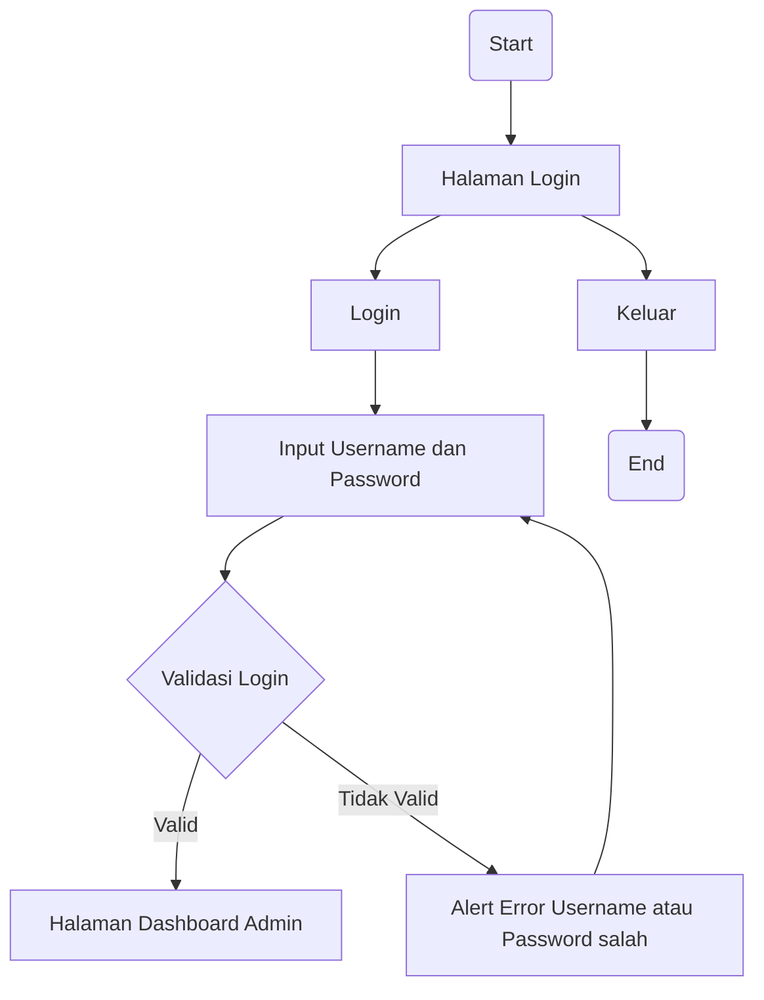

```mermaid
graph TD
    Start(Start) --> A[Halaman Login]
    A --> B[Login]
    A --> D[Keluar]
    
    B --> E[Input Username dan Password]
    E --> F{Validasi Login}
    F -->|Valid| G[Halaman Dashboard Admin]
    F -->|Tidak Valid| B1[Alert Error Username atau Password salah]
    B1 --> E

    
    End(End)
    D --> End
```
